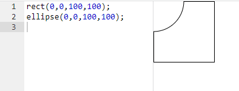

# 2020.01.26\(Sun\) TIL

칸 아카데미 - JS\(1\)

1. **자바스크립트의 도형 그리기** 

* ellipse\(x,y,w,h\) - x,y가 원의 중심을 기준으로 함. 
* rect\(x,y,w,h\) - x,y는 중앙이 아닌 좌상단 모서리를 기준으로.
* line\(x1,y1,x2,y2\) - x1,y1 선이 시작되는 위치,  x2, y2는 선이 끝나는 위치. y1과 y2의 값이 차이가 난다면 직선 아닌 대각선이 그려질 것.
* background\(r,g,b\) : 배경색 지정. 프로그램 상단에 위치해야 합니다.
* fill\(r,g,b\) : 도형 내부의 색 칠하기. fill 이후에 등장하는 모든 도형을 이 색으로 칠하라는 뜻. 도형의 색을 나타내는 명령어는 도형보다 앞서 등장해야.
* stroke\(r,g,b\) 
* strokeweight\(\) : thinkness / 바깥 방향으로.
* noStroke\(\)

